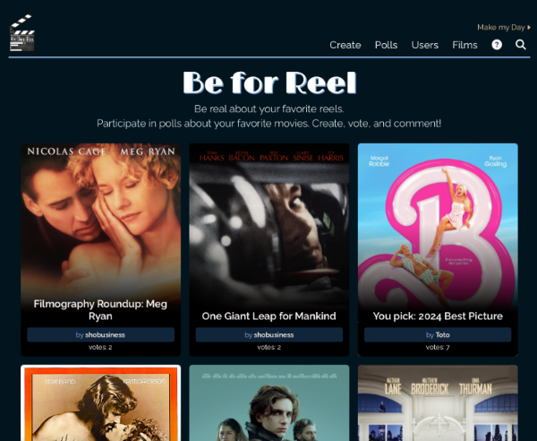
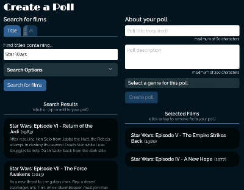
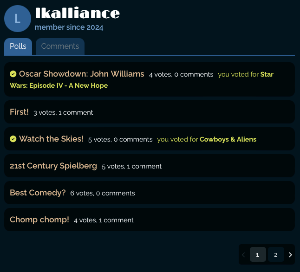
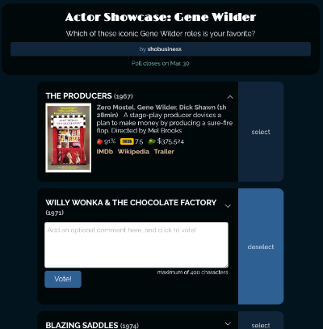
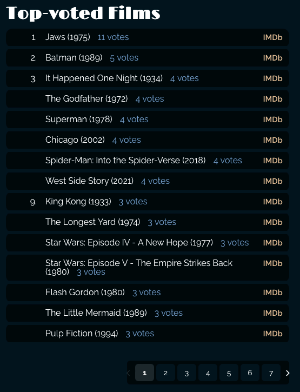

# Be for Reel

## Description

Be for Reel is a website for movie lovers! As a movie lover, I enjoy taking part in debates about film, and Be for Reel enables users to do just that. Create polls, vote on them, and leave reviews.

You can view and use Be for Reel [here](https://be-4-reel-9f2cbf237830.herokuapp.com).

## Table of Contents

- [Installation Instructions](#installation-instructions)
- [Usage Information](#usage-information)
- [Application Features](#application-features)
- [Credits](#credits)
- [Software License](#software-license)
- [Contact the Developer](#contact-the-developer)

## Installation Instructions

Be for Reel is a web app, and all it requires is a web browser to interact with it. Your web browser must have JavaScript turned on. To interact with any of the features of Shelf Life, you must sign up for a (currently free) account.

## Usage Information

Using Be for Reel is simple. First of all, the user must have an account. Visit the site, and click the "Log in/Sign up" link in the upper right. In the signup form, provide a unique email address and username and a password to create the account.

Though the account is created immediately, your email will need to be verified before you can create or view content. Click the link in the email you receive from Be for Reel to verify your account.

### Create a Poll

Upon logging in, you can view and vote in polls; visit the Polls page for a current list of all submitted polls. You may also create their own polls, by accessing the Create a Poll page (link in the navbar or in the contextual user menu).

On the Create a Poll page, first search for the films you wish to include in the poll. There are two search mechanisms:

--TITLE SEARCH: Under the "Title Search" tab, enter a text string to search for in the film title you're looking for. You can expose other search options, including searching for films from a specific decade, for films of a certain length, for films of a certain rating, for films of a certain genre, or films that won an Academy Award or were nominated for Best Picture.

--AI SEARCH: Under the "AI" tab, enter a description of the films you'd like to find, to fill in the "Find feature films that..." request. See more on this feature below.

Once you've executed a search, the search results appear below the search form. Click or tap on any of the results to place it in your list of selected films (remove a film from your selected list by clicking or tapping on it again). Repeat the process until you've collected all of the films (up to 12) that you'd like to include as options in your poll. Then give your poll a name and, optionally, a description, and click the Create button.

### ChatGPT film search

When creating a poll, you have the option to search for the films to add using either a title search or an AI search. The intent of Be for Reel is to limit the poll options to only feature films that were released in theaters. The title search makes use of an API from [TV-API](https://tv-api.com), and is effective at strictly enforcing that limit.

The AI search operates through [OpenAI's](https://openai.com/product) ChatGPT API. ChatGPT, which is not a strict data API, can return results that would normally fall outside those limitations. Sometimes it can return identifiers that don't match up with the films it returns. On the back end, when you submit a poll to create, Be for Reel confirms each film option to ensure that it does meet the correct criteria and that its id does correctly match up with the right film. If any of your submitted film options is removed, you will be notified in the interface and the erroneous films will be removed from your list of selected films, giving you the option to re-compose your list before creating the poll.

### Genre Assignment

Each poll is assigned one or more genres automatically. It will appear on genre-specific poll lists for any genre that IMDb has assigned to every single movie option in the poll. During the poll creation process, the user can also add their own choice of genre from a list of available genres that IMDb has assigned to at least half of the movies in the poll.

### Vote on a Poll

To vote on a poll, click or tap on a poll name on either the Home page (where six random polls appear) or on the Polls page, or on a user profile. View the films provided as poll options, each with a list of stars, a brief plot synopsis, and links to the film's IMDb page, Wikipedia page, and trailer. Select a movie for which to cast your vote by clicking or tapping on its "Select" button to expose a comment field and a "Vote" button. Second thoughts before casting your vote? Click or tap the film again to de-select it, or just click or tap on a different option to select that one instead.

When you're satisfied with your selection, enter an optional comment or review, and click the "Vote" button. Each user may vote only once on each poll. Return to the poll and the voting controls are gone, replaced by the current vote totals in the poll. If the voting has closed on the poll, the winner(s) will be highlighted.

Each user has their own profile page, listing each of the polls they've created, and any comments they've left. Click a username anywhere (listed with a poll, or your own user name in the navigation at the top) to view that user's profile.

### Poll Expiration

The polls close on each poll a set number of days after its creation. That time period is currently 30 days.

### Poll Deactivation

A user can choose to deactivate any of their own polls within a window of two days after creation. The deactivation link appears with the poll on the user's profile page. Once a poll is deactivated, there is no reactivation ability. A deactivated poll only appears on the creator's user profile, visible only to the creator.

### Poll Editing

This function is not yet completed, but a foundation is present to delay making a newly-created poll visible to other users until a set time period (measured in minutes) has elapsed. The poll will only be visible to the creator on their own profile page, with a link to edit. It will not be visible to anyone else.

### View the list of films

This page shows you the top 100 films that have received the most votes on all polls.

## Application Features

- Create movie polls
- Vote in movie polls
- Leave comments accompanying your vote

## Credits

Be for Reel was originally created by [Lee Klusky](https://www.linkedin.com/in/lee-klusky/), [Maggie McQuown](https://www.linkedin.com/in/maggie-mcquown/), [Justin Breueske](https://github.com/Justin-Brueske), Gabriella Swenson and Elsadek Elnimiry. This rewriting of the application is by Lee Klusky. I've rebuilt Be for Reel in [React](https://react.dev), [Node](https://nodejs.org), [Express](https://expressjs.com), [MongoDB](https://www.mongodb.com) and more. To the contributors to these open-source projects, we give our great thanks.

This application would also not exist if it were not for the help, guidance and wisdom of the instructional staff of the [University of Minnesota Full Stack Coding Bootcamp](https://bootcamp.umn.edu/coding/): [Jack Linhard](https://www.linkedin.com/in/jack-linhart/), [Daniel Vitelli](https://www.linkedin.com/in/daniel-vitelli/), [Dillon Riecke](https://www.linkedin.com/in/dillon-riecke/) and [Konner Hartman](https://www.linkedin.com/in/konner-hartman/).

And of course we owe gratitude to content providers of all types at places like [Stack Overflow](https://www.stackoverflow.com), the [Mozilla Developer Network](https://developer.mozilla.org) and [W3Schools](https://w3schools.com).

## Software License

©2024, Lee Klusky

Be for Reel is not currently open source, and has no license for use of the code.

## Questions?

Contact me at <a href="mailto:lkbootcamp@yahoo.com">lkbootcamp@yahoo.com</a>, or visit my [GitHub profile](https://www.github.com/lkalliance).
